# OregoneState-CP

I show thanks for the author of the underlying code from "COMPUTATIONAL PHYSICS" & "COMPUTER PROBLEMS in PHYSICS" written by RH Landau, MJ Paez, and CC Bordeianu (deceased) and copyright R Landau, Oregon State Unv, MJ Paez, Univ Antioquia, C Bordeianu, Univ Bucharest, 2018.  

```markdown
wget -r -np -l 0 http://sites.science.oregonstate.edu/~landaur/Books/CPbook/
```

## 3QMdisks

|     num | sol                             | sol                             |
| ------: | ------------------------------- | ------------------------------- |
| num= 50 | 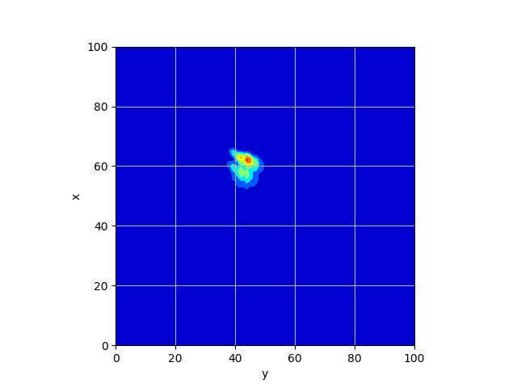 | 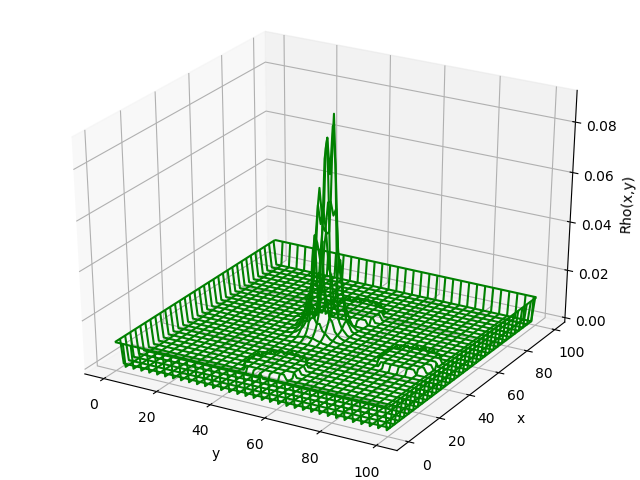 |
| num=100 | 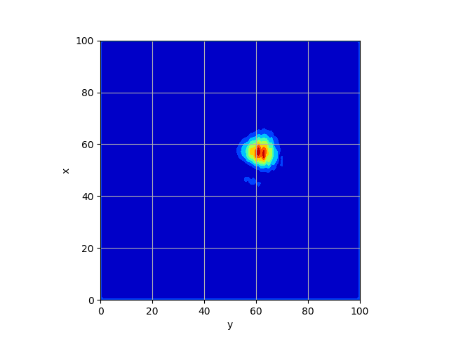 | 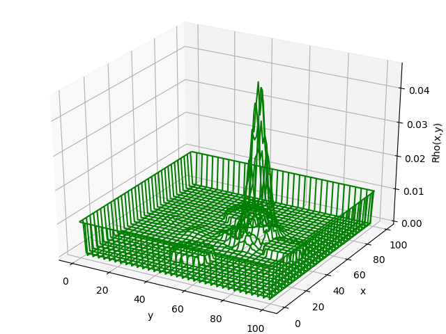 |
| num=110 | 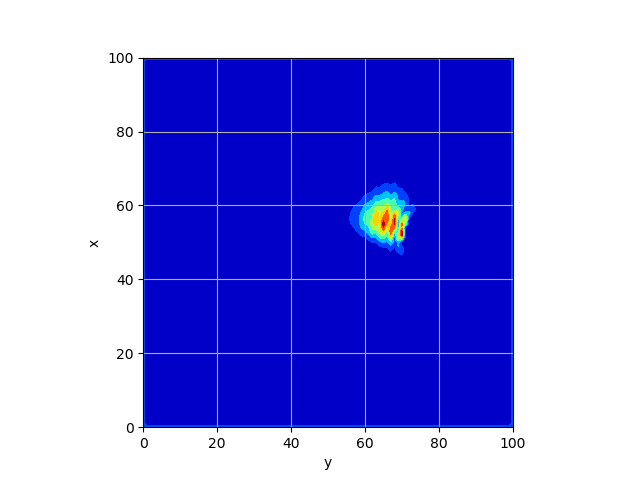 | 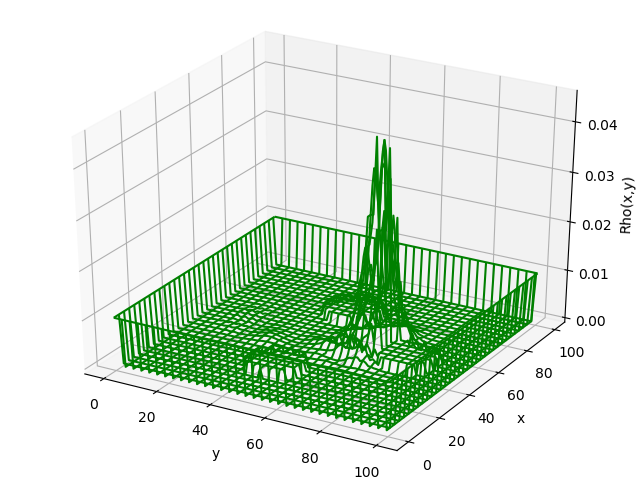 |
| num=125 | 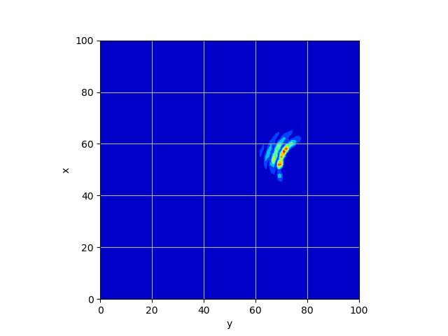 | 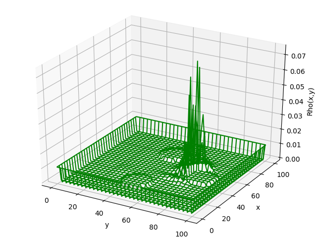 |
| num=150 | 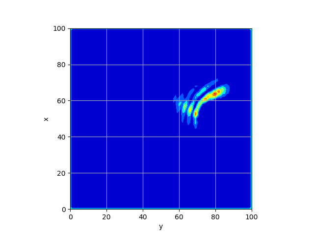 | 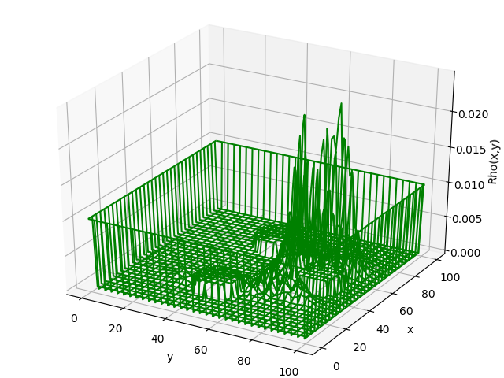 |
| num=200 | 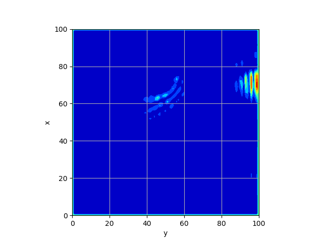 | 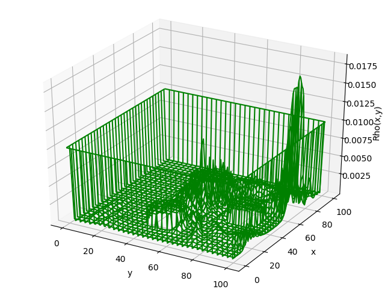 |
